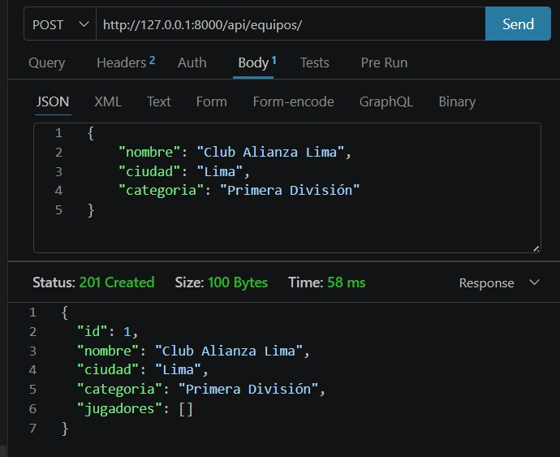
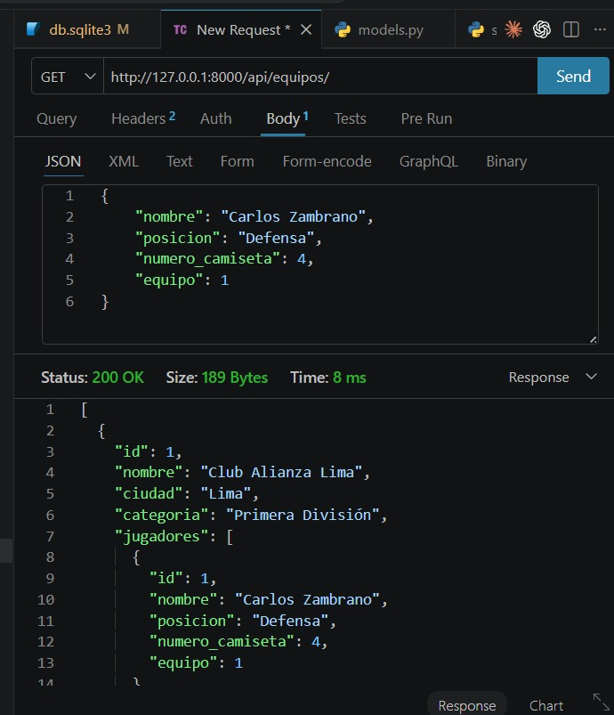
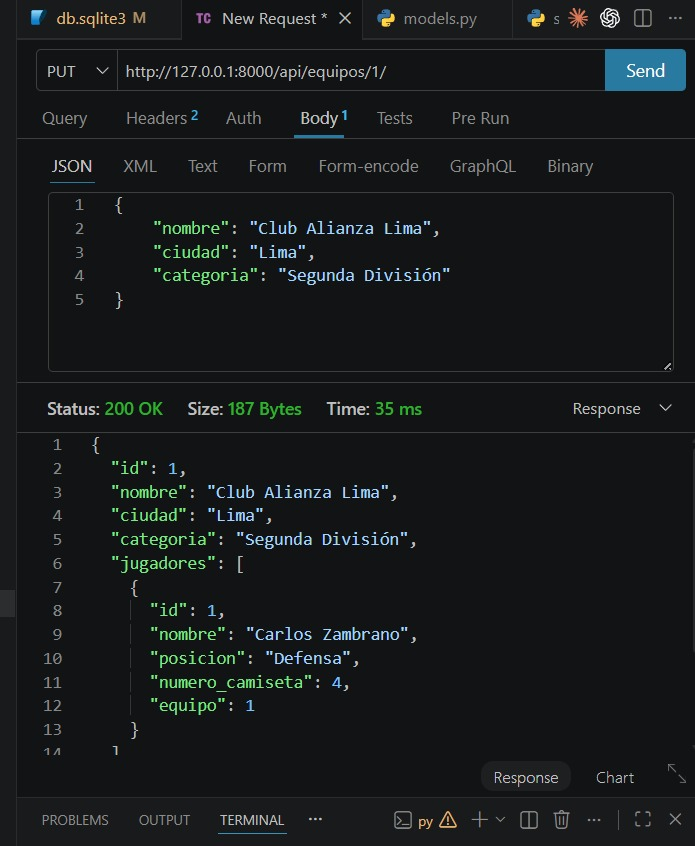
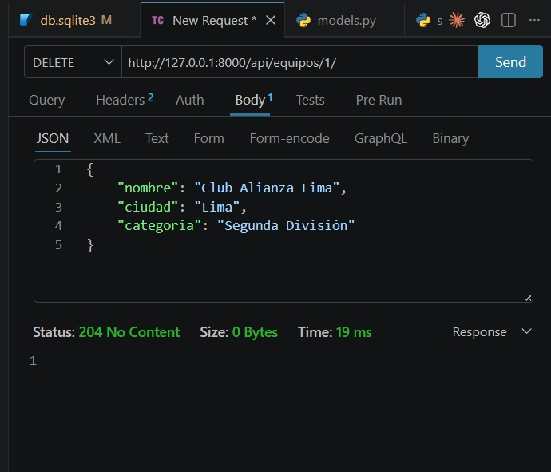
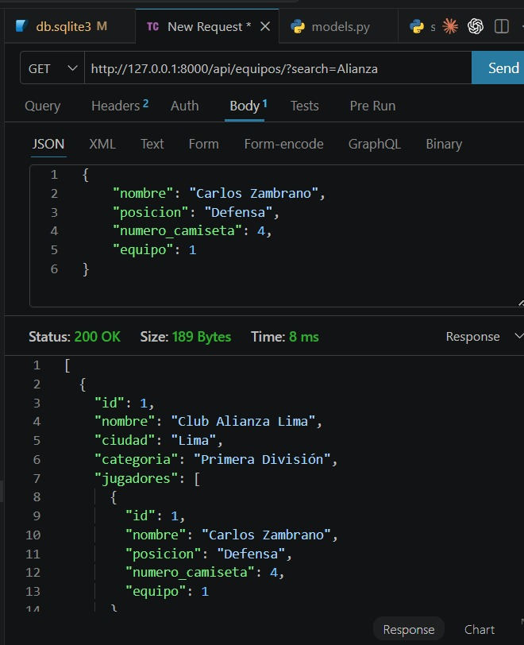
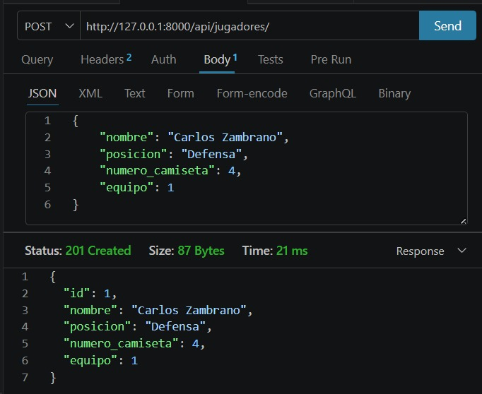
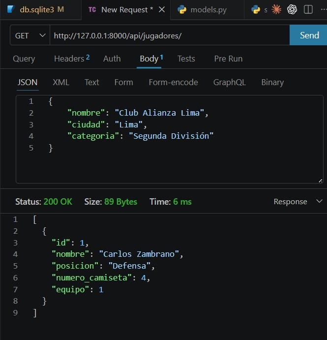

# Sportify API

API REST para gestionar equipos deportivos y sus jugadores, desarrollada con Django y Django REST Framework.

## Tecnologías usadas

- Python 3.13
- Django 4.2
- Django REST Framework
- Django Filter
- MySQL 

## Instrucciones para ejecutar el servidor

1. Activar entorno virtual: `venv\Scripts\activate`
2. Instalar dependencias: `pip install django djangorestframework django-filter`
3. Correr migraciones: `py manage.py migrate`
4. Iniciar servidor: `py manage.py runserver`

## 📌 Endpoints

| Método | Endpoint | Descripción |
|--------|----------|-------------|
| GET | `/api/equipos/` | Lista equipos |
| POST | `/api/equipos/` | Crea equipo |
| PUT | `/api/equipos/{id}/` | Edita equipo |
| DELETE | `/api/equipos/{id}/` | Elimina equipo |
| GET | `/api/equipos/?search=` | Busca equipo |
| GET | `/api/jugadores/` | Lista jugadores |
| POST | `/api/jugadores/` | Crea jugador |
| PUT | `/api/jugadores/{id}/` | Edita jugador |
| DELETE | `/api/jugadores/{id}/` | Elimina jugador |

## 📸 Capturas
### POST /api/equipos/

### GET /api/equipos/

### PUT /api/equipos/{id}/

### DELETE /api/equipos/{id}/

### GET /api/equipos/?search=

### POST /api/jugadores/

### GET /api/jugadores/
